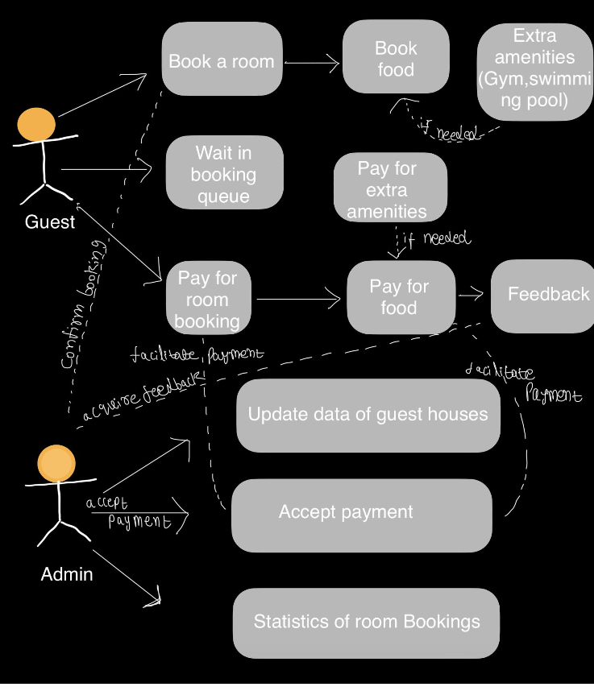

# Online Guest House Booking System
## Installation and Running
Clone the repository 
```bash
git clone https://github.com/nanidura/Guesthouse_booking.git
```
use the following command  to install all the required libraries 

```bash
pip install -r requirements.txt
```
use the following command to run the LLM SQL Generator interface

```bash
python3 main.py
```
Make sure you have generated a security key in Google for sending OTP to users from your prefered mail.

## User diagram



## Object class diagram


## Salient features 
1. User Verification
2. Checking the availability of rooms
3. Booking a room and other amenities
4. Queuing system for room booking
5. Cancellation


